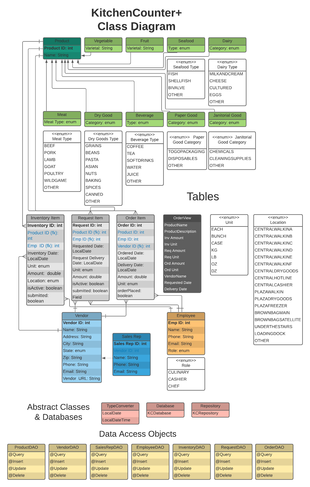

 
# KitchenCounter+
a team-oriented inventory, request, and order system for food service 
organizations. Using Android tablets, the entire kitchen team can use 
the **KitchenCounter+** software to aggregate and automate the ordering 
process. The software's main principle is that the traditional ordering 
process consists of three parts that answer these three questions: 
"How much do we have?" (INVENTORY), "How much do we need?" (REQUEST), and, 
therefore, "How much do we need to order?" (ORDER). **KitchenCounter+** 
allows each team member to add items to inventory and the requested products 
list. The order section consolidates all of the entries and allows the 
purchasing manager to place orders and communicate the daily orders to the 
team via text or email.

## Build Status
- in progress; started 05/21
- order section is in progress
- I have later plans to move the database to cloud storage; for now the DB is stored on device

## Code Style
This project was coded using the MVC model and the Room Framework. The 
source code is divided into Database, Entities, DAOs, UI (activities & fragments),
and Tables (including Views). The programming language is Java.

## Class Diagram
The structure of this application is in this diagram:

## User Interface
The UI is divided into three sections: INVENTORY, REQUEST, and ORDER. 

